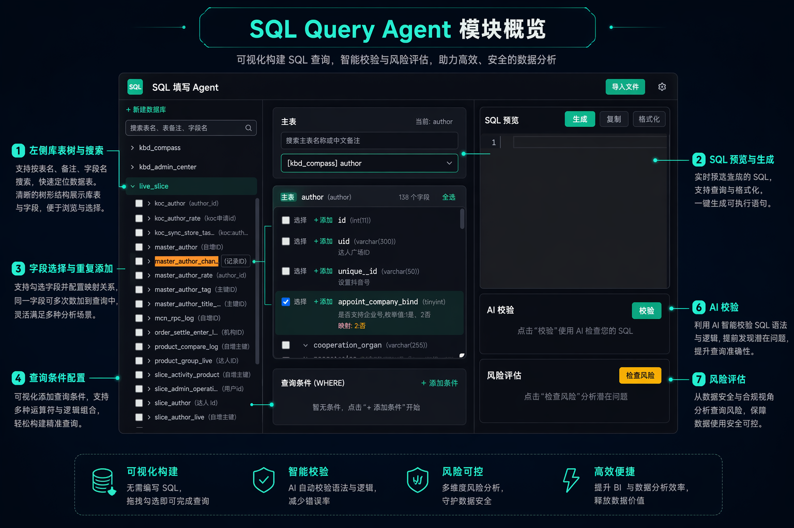

# SQL Query Agent

可视化 SQL 生成工具。通过图形界面选择主表、配置字段、设置条件和关联关系，快速拼装查询 SQL，适合内部数据表较多、字段注释不够统一的场景。

## 模块概览



## 当前能力

- 支持 `JSON` 和 `SQL DDL` 两种格式导入库表结构
- 自动解析字段注释中的数字映射，兼容多种不统一写法
  - `1-有效 2-无效 3-待确认`
  - `1橱窗更新 2删除橱窗 3添加橱窗`
  - `1:是 2:否`
  - `枚举值:1是、2否`
- 选择映射字段时，生成 SQL 会自动输出中文映射列
- 支持同一字段重复添加，分别配置不同使用方式
- 支持字段使用方式
  - 原始值
  - `SUM / AVG / COUNT / MAX / MIN`
  - 时间戳转日期 `YYYY-MM-DD`
  - 时间戳转日期时间 `YYYY-MM-DD HH:mm:ss`
- 支持同一张表重复关联，并为每次关联配置独立别名
- 主表通过查询区顶部下拉选择，避免误点左侧树导致已选内容被清空
- 左侧库表树支持搜索表名、表备注、字段名、字段备注
- 支持 SQL 预览、复制、格式化
- 支持规则校验和风险评估
- 数据保存在浏览器本地 `localStorage`

## 最近更新

- 去掉了原先的标签系统，左侧列表现在专注于浏览和查找
- 修复了 SQL DDL 表注释解析错误
- 表注释中的 `COLUMNAR=1` 会自动清洗
- 字段注释和映射识别逻辑做了统一整理
- 已选字段区域支持复制同字段实例、删除实例、单独设置使用方式

## 快速开始

```bash
npm install
npm run dev
```

构建生产版本：

```bash
npm run build
```

## 使用流程

1. 导入 JSON 或 SQL DDL 文件
2. 在顶部选择主表
3. 在字段列表中添加主表字段或关联表字段
4. 为字段设置使用方式，例如求和、计数、转日期
5. 在 `JOIN / WHERE / ORDER BY / LIMIT` 中补充查询逻辑
6. 在右侧生成并校验 SQL

## 映射识别说明

字段注释中如果存在“数字 -> 中文”这类枚举关系，系统会尽量自动识别，并在生成 SQL 时输出 `CASE WHEN` 中文列。

例如字段注释：

```text
状态 1-有效 2-无效 3-待确认
```

生成 SQL 时会输出类似：

```sql
CASE `table`.`status`
  WHEN '1' THEN '有效'
  WHEN '2' THEN '无效'
  WHEN '3' THEN '待确认'
  ELSE ''
END AS "状态名称"
```

如果注释里只有“是、否”这类描述，没有明确的数字键值，系统只会清洗展示文案，不会强行生成错误映射。

## 支持的数据格式

### JSON

```json
{
  "databases": [
    {
      "name": "shop_db",
      "comment": "商城库",
      "tables": [
        {
          "name": "orders",
          "comment": "订单表",
          "fields": [
            { "name": "id", "type": "int", "comment": "订单ID" },
            { "name": "status", "type": "tinyint", "comment": "状态 1-待支付 2-已支付" }
          ]
        }
      ]
    }
  ]
}
```

### SQL DDL

```sql
CREATE TABLE orders (
    id INT UNSIGNED AUTO_INCREMENT PRIMARY KEY COMMENT '订单ID',
    status TINYINT NOT NULL COMMENT '状态 1-待支付 2-已支付',
    created_at INT UNSIGNED NOT NULL COMMENT '创建时间'
) COMMENT '订单表';
```

## 技术栈

- React
- TypeScript
- Vite
- Tailwind CSS
- Zustand
- Monaco Editor

## 项目结构

```text
src/
├── components/
│   ├── Header/
│   ├── Sidebar/
│   │   └── DatabaseTree.tsx
│   ├── QueryBuilder/
│   │   ├── FieldSelector.tsx
│   │   ├── WhereBuilder.tsx
│   │   ├── JoinConfig.tsx
│   │   └── OrderByLimit.tsx
│   ├── SQLPreview/
│   └── Validation/
├── stores/
├── utils/
└── types/
```

## 说明

- 当前主要面向 MySQL 风格 DDL
- 浏览器本地缓存可能会保留旧导入结果；当导入规则更新后，重新导入一次数据可以获得最新解析效果

## License

MIT
